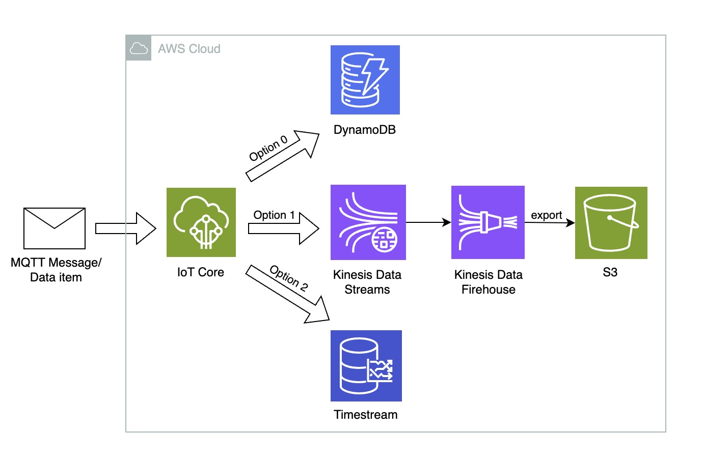

# AQvis
**Demonstration: https://yantdqyzzn.w-2.dockerdeploy.cloud/**

Sensor data visualisation web app for [IdealAQ](https://idealaq.com/).

## Frontend
[ [GitHub repository](https://github.com/drohal3/AQvis-frontend) ]

The frontend is implemented in ReactJS with MaterialUi. The data is visualised in plots provided by [Recharts](https://recharts.org/en-US/).

## Backend
[ [GitHub repository](https://github.com/drohal3/AQvis-backend) ]

The backend is implemented in FastAPI. It provides a simple API handling HTTP requests. Although, GraphQL can be added later if needed.
The data related to the website (user and organisation data) is stored in MongoDB or Amazon DocumentDB. 
The measurement data is queried from their dedicated storage in AWS. 
In the early stages, it is DynamoDB. 
For later, infrastructure utilizing Kinesis Data Streams, Kinesis Firehose and S3 or alternatively storage in time series specialised database Timestream is ready to be provisioned using Terraform.

## Deployment
Both, frontend and backend apps are deployed using the same strategy with different steps in their deployment pipelines owing to the fact they use different technology stacks.
The deployment pipelines are defined using GitHub actions. In the pipelines, the linting is checked, tests are run, docker images are built and published to image repository (AWS ECR and/or Docker Hub). After a successful push to an image repository, the action triggers notification in a Discord channel.

The deployment pipeline also triggers a new deployment in AWS ECS with the newest image version/tag (disabled for now).

### AWS solution
[[Github repository](https://github.com/drohal3/AQvis-infra)]

The application is running in an ECS cluster with Fargate. The task definition defines three tasks:
- frontend app
- backend app
- nginx

The nginx is used as a reverse proxy. It routes traffic with path starting with */api/* to the backend and to the frontend otherwise.

A custom nginx image ([Github repository](https://github.com/drohal3/AQvis-nginx)) is used for this purpose. The custom repository simplifies defining nginx.conf file.

**Problem:** The frontend app requires domain or IP address of the backend. 
However, the public IP address is not static, and it changes every time the application is deployed. Hence, at the time the frontend app is started, with the current minimal set up the public IP address is not known. 
The possible solution utilizes load balancer to assign a static IP address. 
However, for this project a more light-weight and cost-efficient solution is needed.

> **Note:** this solution was put on hold due to its unnecessary high complexity and operational costs. A simpler and more cost-efficient solution (see below) was chosen for time being.

### Dockerdeploy solution
This solution utilizes [dockerdeploy.cloud](https://dockerdeploy.cloud/) service to host the backend and frontend applications. 
It is used temporarily as a cost-efficient solution for the project demonstration purposes.

## Measurement data
[[Github repository](https://github.com/drohal3/AQinfra-data/tree/dynamo)]

The measurement data is published by devices as MQTT messages.
Usually, each device published data once a second. The data is handled by IoT Core AWS service, processed and forwarded to temporary or permanent storage.

There are three strategies of data processing considered and analyzed. They are pictured in the picture below.

For demonstrating purposes of this project, DynamoDB is used. However, the infrastructure for the other options can be also found in the linked GitHub repository.

## Measurement simulation
[[Github repository](https://github.com/drohal3/aws-timeseries-experiment/tree/main/device_simulation)]

For the demonstration and testing purposes a python script using [asyncio](https://docs.python.org/3/library/asyncio.html) to simulate X devices running and publishing data concurrently was created and used.

## Related projects
- **AQrpi**: Hardware control software for Raspberry Pi. Uses YML config file tha describes used hardware components and based on it reads and calculates measurement data. The components usually use I2C, SPI and serial interfaces.
